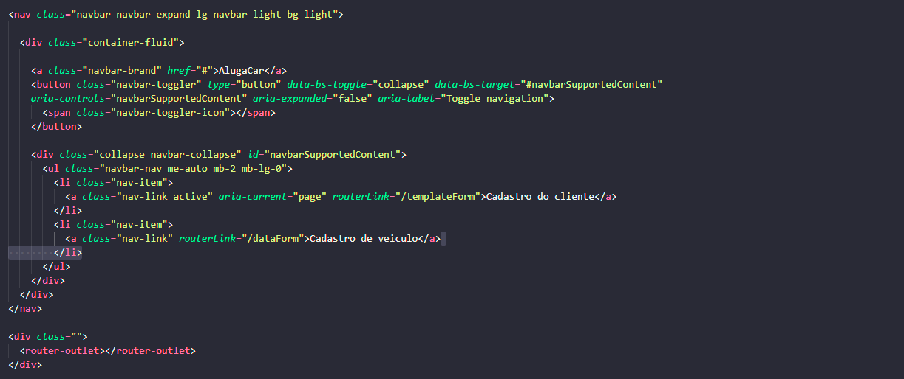
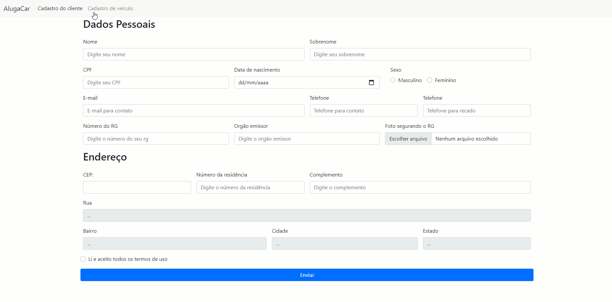
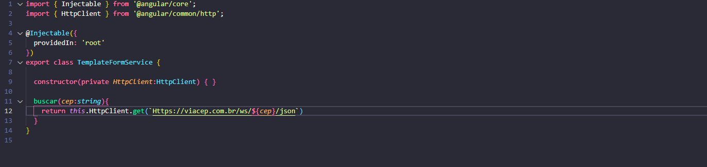
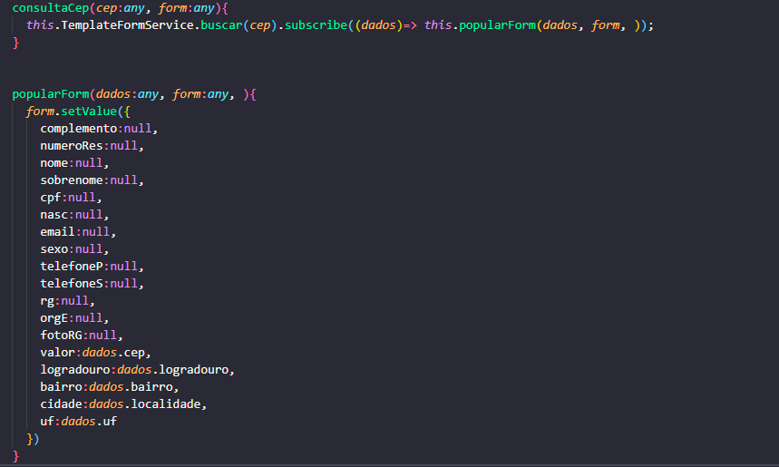
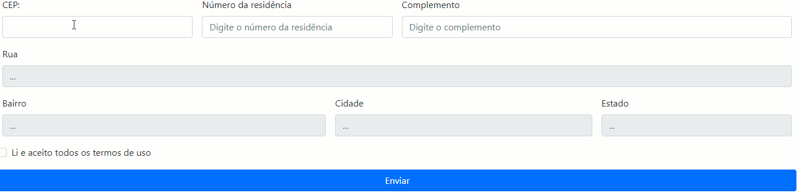
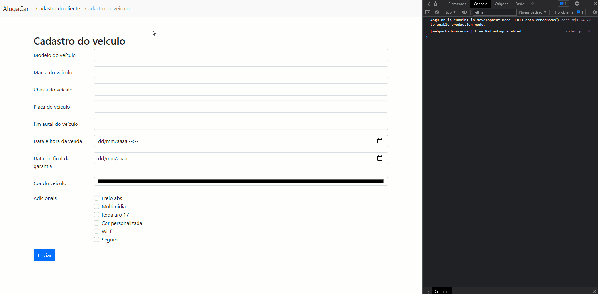

# 1º Projeto de DevWeb
 

Aluno Pedro Henrique Vilela Silva RA: 202108528188
Aluno: Gustavo de Arruda Barbosa RA: 202108774294

 
Nosso grupo ultilizou a versão do @angular/cli 10
## 1º etapa
 

Como o nosso prazo e disponibilidade foi curto decidimos fazer algo mais simples
porem funcional, a ideia inicial era de fazer a homepage ser um catalogo de veiculos
que estivesse disponivel para locação, porem dicidimos de ja iniciar na homepage de
cadastro do usuario. Fizemos 2 páginas de cadastro: 1- Cadastro do usuário, 2- Cadastro
do veiculo. 

 

 Para isso fizemos uma nav bar com o sistema de rotas para que pudessemos navegar de um formulario a outro
 
<h1 align="center">
   
</h1>
 

 Com isso obtinhamos esse Resultado

 
<h1 align="center">
   
</h1>

## 2º etapa

A segunda etapa foi fazer o forumalirio de cadastro do cliente com suas informações básicas, usamos a função do *FormsModule*
para podermos criar um console log com as informações obtidas pelo formulario.

Usamos um service do angular para poder fazer a consulta do cep na api do ViaCep para isso tivesse que usar o *HttpClientModule*

<h1 align="center">
   
</h1>

Fizemos uma função no component que quando o foco do input do cep é perdido, o sistema pega o valor digitado, faz a consulta na api atraves dessa service e logo após popula os campos correspondentes

<h1 align="center">
   
</h1>

Obtendo este resultado

<h1 align="center">
   
</h1>

## 3º etapa

No outro formulario fizemos o básico. Usando o bootstrap fizemos um formulario que coleta os dados do veiculo a ser cadastrado no sistema e um tambem uma função que armazena esses dados em um console log 

<h1 align="center">
   
</h1>
# tab
